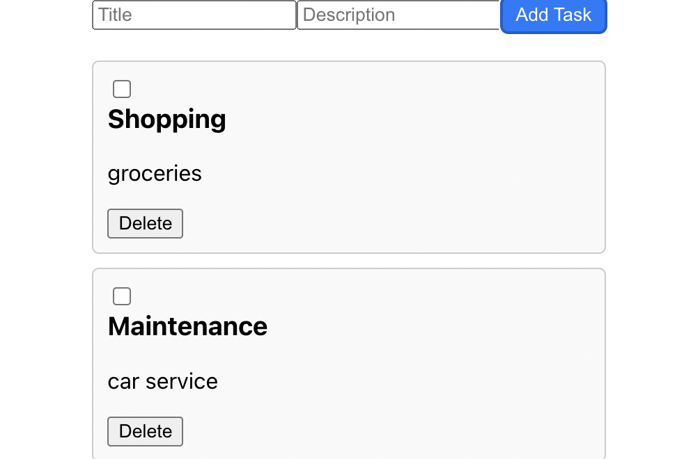
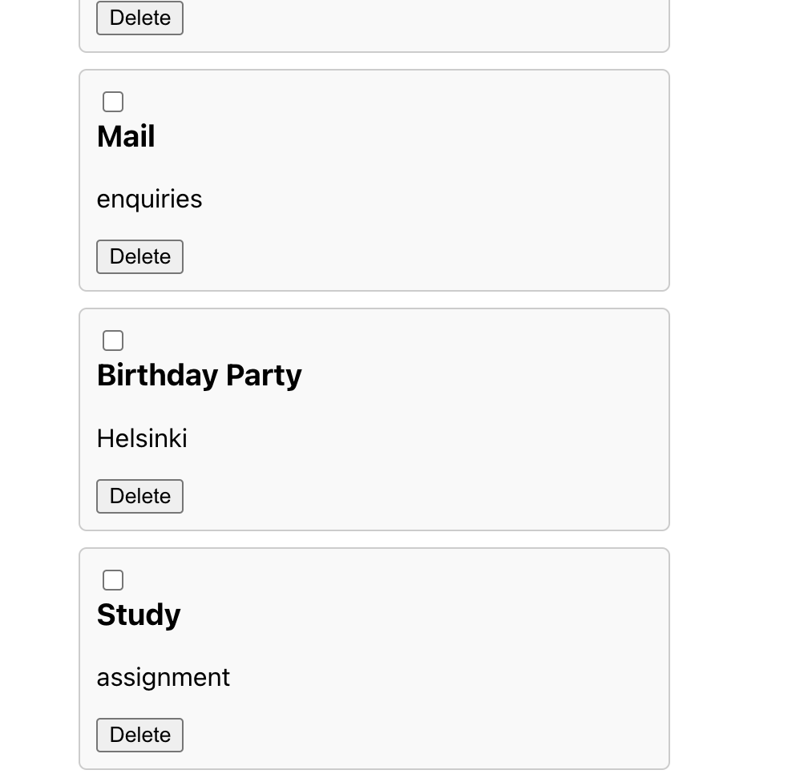

# Task Management Application

This is a simple task management application built with React. Users can add, delete, and mark tasks as completed.

## Features

- Add new tasks with a title and description.
- Mark tasks as completed.
- Delete tasks.
- Tasks are saved locally using `localStorage`, ensuring persistence even after page refresh.

## Technologies Used

- React
- HTML
- CSS

## Getting Started

To run the project locally, follow these steps:

1. Clone the repository:
2. Navigate to the project directory:
3. Install dependencies:
4. Run the development server:
5. Open your browser and visit [http://localhost:3000](http://localhost:3000) to view the application.

## Screenshots

